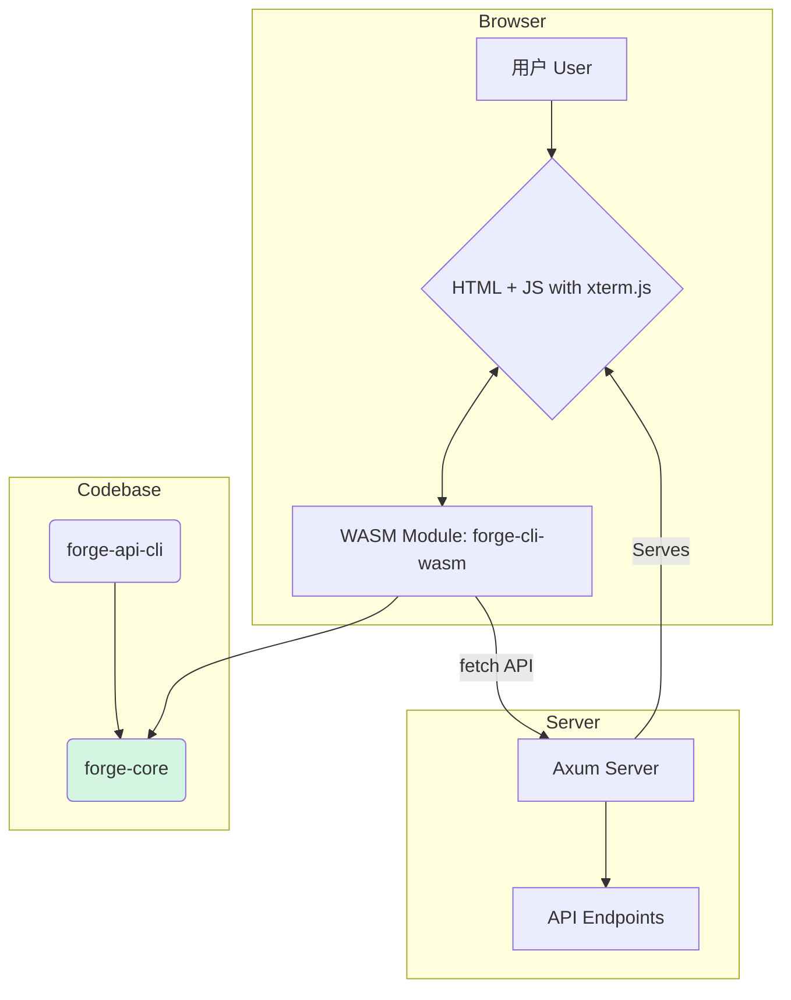

# `forge-cli` WASM 版本及浏览器内终端UI设计文档

**日期**: 2025年08月07日
**作者**: Gemini

## 1. 愿景与目标 (Vision & Goals)

本文档旨在设计并规划 `forge-api-cli` 的一个全新形态：一个基于 WebAssembly (WASM) 的、可直接在浏览器中运行的版本，并为其配备一个交互式的终端用户界面 (UI)。

**核心目标**:
- **提供零安装的客户端**: 任何有权访问服务的人，只需通过一个特定的URL（例如 `/cli-ui`），即可获得一个功能完备的、与后端API完全同步的交互式命令行工具。
- **实现与原生CLI的功能对等**: 浏览器内的CLI版本应与原生版本共享同一套核心Rust代码，确保命令、参数、验证逻辑和执行结果的100%一致。
- **提升开发者体验**: 为API的探索、测试和调试提供一个比Swagger UI更高效、更灵活的选择，尤其适合习惯命令行操作的开发者。

## 2. 核心优势 (Core Advantages)

1.  **零配置，开箱即用**: 极大地降低了API的探索和使用门槛，开发者无需在本地安装任何特定版本的CLI工具。
2.  **绝对的一致性**: 从根本上杜绝了因客户端版本不匹配或实现差异导致的行为不一致问题。单一事实来源（Rust核心逻辑）保证了体验的统一。
3.  **强大的交互能力**: 相比于图形界面的点击操作，CLI提供了更快速、可编写脚本的交互方式，能轻松处理复杂的请求和自动化任务。
4.  **技术栈统一与前瞻性**: 整个解决方案将基于 Rust + WASM 生态，技术栈纯粹、现代，是项目技术实力的一次绝佳展示。

## 3. 技术挑战与选型 (Technical Challenges & Technology Choices)

1.  **终端环境模拟 (Terminal Emulation)**:
    - **挑战**: 浏览器中没有原生的终端环境，无法直接复用为系统终端设计的 `reedline` 库及其高级交互功能（如智能补全、复杂编辑模式等）。
    - **解决方案**: 采用业界标准的 **`xterm.js`** 库。它负责在前端页面中渲染终端界面、捕获用户输入，并将输出结果展示给用户。
    - **权衡**: 我们需要在前端的JavaScript/TypeScript代码中手动实现一个REPL（读取-求值-打印-循环）逻辑。对于MVP阶段，我们将实现一个基础的、能处理单行命令的REPL。

2.  **网络请求 (Networking)**:
    - **挑战**: 在WASM环境中，所有网络请求都受浏览器安全策略的约束，必须通过 `fetch` API 发起，并且需要处理CORS（跨域资源共享）问题。
    - **解决方案**: `reqwest` 库对 `wasm32` 目标有良好支持，在编译时会自动将其后端切换为 `fetch`。这部分的技术成本较低。
    - **服务端要求**: 后端Axum服务必须配置正确的CORS中间件，以允许来自 `/cli-ui` 页面的跨域请求。

3.  **WASM文件体积 (WASM Binary Size)**:
    - **挑战**: 未经优化的Rust WASM二进制文件可能体积较大，影响首次加载速度。
    - **解决方案**: 在打包过程中使用 `wasm-pack` 并开启release模式，同时集成 `wasm-opt` 工具进行代码优化，并开启LTO（链接时优化）来显著减小文件体积。

## 4. 架构设计 (Architecture Design)

新架构将引入一个共享的核心库和一个专门用于WASM编译的库。

**架构图示**:

**组件分解**:
- **`forge-core` (新)**: 一个全新的 `lib` Crate。它将包含从原生CLI中抽离出来的、与UI无关的核心逻辑，例如：OpenAPI规范解析、`clap`命令树的动态构建、请求参数的组织等。
- **`forge-api-cli` (重构)**: 现有的原生CLI将不再包含核心逻辑，而是作为一个轻量级的包装器，依赖并调用 `forge-core`。
- **`forge-cli-wasm` (新)**: 一个新的 `cdylib` 类型的Crate，它同样依赖 `forge-core`。它将使用 `wasm-bindgen` 来导出一套简洁的接口（如 `init_cli`, `run_command`）给JavaScript调用。
- **`frontend` (新)**: 一套纯粹的前端静态资源（HTML/CSS/JS），负责初始化 `xterm.js`、加载WASM模块，并实现浏览器中的REPL交互逻辑。
- **Axum集成**: 我们将使用 `rust-embed` 或类似的库，将 `frontend` 目录下的所有静态资源直接嵌入到服务端的主二进制文件中，并通过一个新的路由（`/cli-ui`）来提供服务，实现真正的单文件部署。

## 5. 实施计划 (Implementation Plan)

我们将分阶段进行，确保每一步都稳固可靠。

### 阶段一: 核心逻辑重构与WASM桩 (Core Logic Refactoring & WASM Scaffolding)
1.  **创建`forge-core`**: 初始化一个新的 `lib` Crate 用于存放共享逻辑。
2.  **重构原生CLI**: 将 `forge-api-cli` 中的核心逻辑（主要在 `cli.rs` 和 `client.rs`）抽离到 `forge-core`中。修改原生CLI以依赖 `forge-core`。
3.  **创建WASM Crate**: 初始化 `forge-cli-wasm` Crate，并将其配置为 `cdylib` 类型。
4.  **安装工具链**: 确保已安装 `wasm-pack` (`cargo install wasm-pack`)。
5.  **验证编译链路**: 在 `forge-cli-wasm` 中导出一个简单的 "hello world" 函数，并使用 `wasm-pack` 成功编译它，以确认整个WASM工具链工作正常。

### 阶段二: 前端集成与MVP (Frontend Integration & MVP)
1.  **创建前端骨架**: 在 `service_kit` 目录下创建 `frontend-wasm-cli` 目录，包含一个 `index.html` 和一个 `main.js` 文件。
2.  **集成`xterm.js`**: 在 `index.html` 中引入 `xterm.js` 并完成基本初始化。
3.  **加载WASM**: 修改 `main.js` 以加载 `wasm-pack` 生成的WASM和JS绑定文件。
4.  **调用验证**: 在浏览器中成功调用之前创建的 "hello world" 函数，并在 `xterm.js` 终端或浏览器控制台中看到输出，验证前后端的连接。

### 阶段三: 功能实现与端到端打通 (Feature Implementation & End-to-End Workflow)
1.  **实现WASM接口**: 在 `forge-cli-wasm` 中实现 `init_cli(spec_json: String)` 和 `run_command(command: String) -> String` 等核心接口。
2.  **实现REPL**: 在 `main.js` 中实现一个基础的REPL循环，捕获用户输入，调用 `run_command`，并将返回的结果（成功或失败）写回到 `xterm.js` 终端。
3.  **服务端集成**: 在 `service-template` 中，使用 `rust-embed` 嵌入 `frontend-wasm-cli` 目录，并添加 `/cli-ui` 路由来托管它。
4.  **配置CORS**: 为Axum服务添加CORS中间件，允许来自 `/cli-ui` 的请求。
5.  **端到端测试**: 启动一个服务实例，访问 `/cli-ui`，并成功执行一个真实的API调用。

### 阶段四: 体验优化 (Polish & Enhancements)
1.  **优化体积**: 对最终的 `.wasm` 文件执行 `wasm-opt` 优化。
2.  **增强交互**: 使用 `localStorage` 为浏览器CLI实现一个简单的命令历史记录。
3.  **美化输出**: 调整 `xterm.js` 的样式和颜色，使其更美观。

通过以上计划，我们可以稳步地将这个激动人心的功能变为现实。
